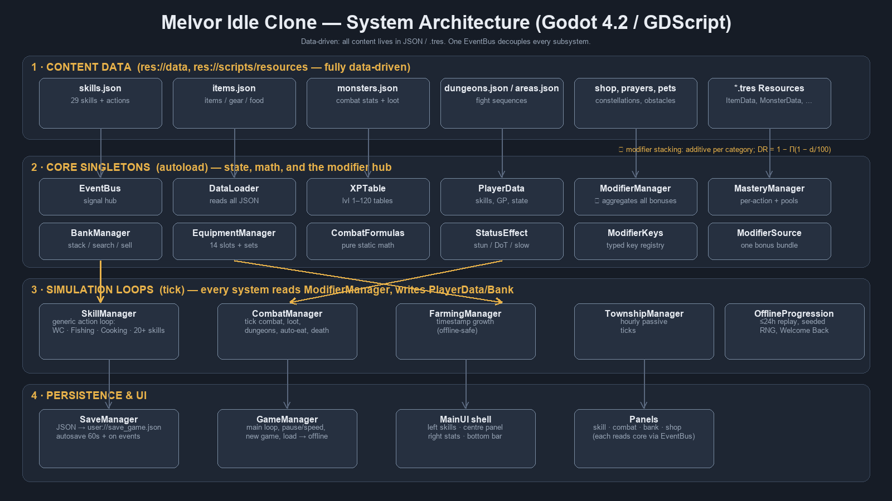
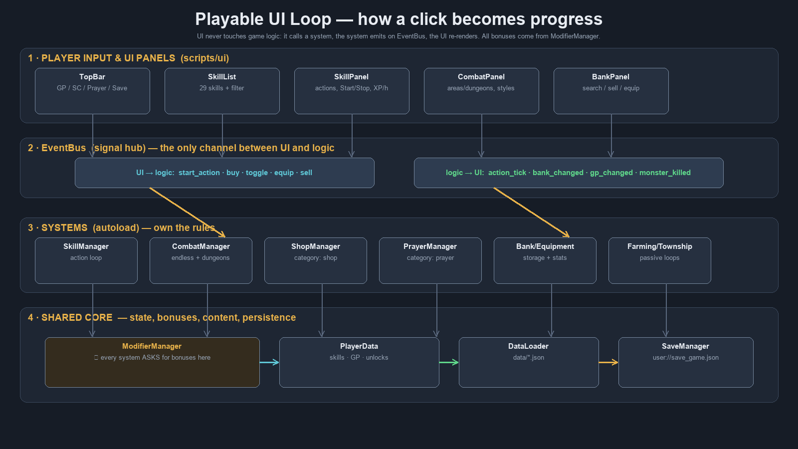

# Melvor Idle Clone — Godot 4.2 (GDScript)

A data-driven, offline-capable idle RPG modelled on **Melvor Idle**. All content lives in
`res://data/*.json` (or `.tres` resources); the code is generic and never hardcodes items,
monsters, recipes, or skills.

> **Engine:** written for **Godot 4.2** (GDScript 2.0). Validated end-to-end with the local
> Godot 4.7.2 headless build — the project imports and runs with **zero script errors**.

---

## 1. Quick start

```bash
# Open the folder in the Godot 4.x editor and press F5, or run headless checks:
godot --headless --path . -- --smoke       # formula / data verification
godot --headless --path . -- --selftest    # end-to-end gameplay self-test
```

## 2. Project layout

```
melvor_clone_godot/
├── project.godot              # autoload registration + settings
├── data/                      # ALL content (JSON) — the "mod" surface
│   ├── skills.json            # 29 skills; 10 fully specified (WC/Fish/Cook/Mine/Smith/Fire/Fletch/Craft/RC/Herb)
│   ├── items.json  monsters.json  dungeons.json  areas.json  game_modes.json
│   └── shop.json  prayers.json  special_attacks.json  constellations.json  obstacles.json
│       familiars.json  pets.json  slayer_tasks.json  shop_township.json
│       cartography_hexes.json  archaeology_sites.json  harvesting_veins.json
├── scripts/
│   ├── autoload/              # 27 singletons (see §4)
│   ├── combat/                # CombatFormulas.gd, StatusEffect.gd
│   ├── resources/             # typed Resource classes (ItemData, MonsterData, ...)
│   └── ui/                    # MainUI shell + TopBar, SkillList, SkillPanel,
│                              #   CombatPanel, BankPanel, ShopPanel, RightPanel,
│                              #   WelcomeBackModal, UIStyle
├── scenes/main.tscn           # entry scene
└── assets/icons/icon.svg
```

## 3. Architecture in one paragraph

Content JSON is read once by **DataLoader**. **PlayerData** holds all persistent state.
Every bonus source (equipment, prayers, potions, pets, agility, astrology, mastery checkpoints,
shop upgrades…) registers a **ModifierSource** with **ModifierManager**, which caches the combined
value of every modifier key. Simulation loops (**SkillManager**, **CombatManager**,
**FarmingManager**, **TownshipManager**) only *ask* ModifierManager and *write* to
PlayerData/BankManager. **EventBus** decouples everything — the UI never touches game logic
directly, it listens to signals. **SaveManager** serialises to JSON, and **OfflineProgression**
replays elapsed time through the *same* code paths.



## 4. Autoload singletons (27)

| Singleton | Responsibility |
|---|---|
| `EventBus` | Global signal hub. |
| `XPTable` | Level 1–120 XP table + lookups. |
| `DataLoader` | Loads `data/*.json`; typed getters. |
| `SaveManager` | JSON save/load; autosave 60 s + on events. |
| `PlayerData` | Skills, GP, currencies, unlocks, completion log. |
| `ModifierManager` | **Heart.** Aggregates all bonuses; stacking + cache. |
| `MasteryManager` | Per-action mastery, pools, 10/25/50/95% checkpoints. |
| `BankManager` | Stacking storage, search/sort/sell, slot-cost curve. |
| `EquipmentManager` | 14 slots, saved sets, stat aggregation. |
| `ShopManager` | Purchases; owns the `shop` modifier category. |
| `PrayerManager` | ≤2 active prayers; registers prayer modifiers; point drain. |
| `PotionManager` | Active potion; registers its effect; charge-based consumption. |
| `FarmingManager` | Timestamp crop growth. |
| `TownshipManager` | Hourly passive production. |
| `CombatManager` | Tick combat, endless areas, dungeons, loot, death, auto-eat. |
| `SkillManager` | Generic action loop for all non-combat skills. |
| `GameManager` | Main loop, pause/speed, new game, load → offline. |
| `OfflineProgression` | ≤24 h replay; seeded RNG. |
| `SlayerManager` | Tasks, kill tracking, rewards, Slayer Shop. |
| `AgilityManager` | 15 obstacle slots, pillars, blueprints. |
| `SummoningManager` | Marks, tablets, 2 familiars, charges, synergies. |
| `AstrologyManager` | Constellation stars purchased with Stardust. |
| `PetManager` | Rare passive pet unlocks. |
| `CartographyManager` | Hex travel, survey, Points of Interest. |
| `ArchaeologyManager` | Excavation tracking + museum donations. |
| `RaidManager` | Golbin Raid: waves, 3-choice picks, Raid Shop. |
| `AssetRegistry` | Art system: loads textures by convention, generates placeholders. |

## 5. Playable UI

The centre panel swaps between four screens; the left sidebar lists all 29 skills.



| Screen | What it does |
|---|---|
| **Skill** | Pick any skill → action list (locked actions greyed), details, Start/Stop, live progress, mastery pool %, ≈ XP/hour, per-action mastery levels. |
| **Combat** | Choose area (endless) or dungeon, attack style + melee sub-style, Start/ **Flee**, live monster/player HP bars, DR/attack-speed/crit readout, prayer toggles. |
| **Bank** | Search + sort (name/qty/value/type), inspect, Sell 1 / Sell All / Equip / Bury / **Use** (drink potions). |
| **Shop** | Buy upgrades with a live affordability/requirement check (reason shown when blocked). |
| Right panel | Equipment by slot + headline combat stats (max hit, DR, attack speed). |
| Top bar | GP / Slayer Coins / Prayer Points / combat level, Pause, Save. |
| Welcome-back | Offline-progression summary modal on load. |

## 6. Data format

### Skill + action (`data/skills.json`)

```json
"woodcutting": {
  "id": "woodcutting", "name": "Woodcutting",
  "category": "non_combat", "type": "gathering", "max_level": 120,
  "actions": [
    { "id": "normal_tree", "name": "Normal Tree", "level_required": 1,
      "base_interval": 3.0, "base_xp": 10, "output_items": { "normal_log": 1 },
      "secondary_outputs": [ { "item_id": "bird_nest", "chance": 0.005 } ],
      "mastery_action_time": 3.0 }
  ]
}
```

Cooking adds `"success_chance"` and `input_items`; artisan skills use a fixed
`mastery_action_time` (Smithing 1.7, Fletching 1.3, Crafting 1.65, Runecrafting 1.7,
Herblore 1.7, Summoning 4.85 s). Gathering nodes add `"node_hp"` and `"respawn_seconds"`:
each completed action depletes the node by 1 (a `node_preservation_percent` roll can prevent it);
at 0 HP the node respawns after its timer.

### Item (`data/items.json`)

```json
"bronze_platebody": {
  "id": "bronze_platebody", "name": "Bronze Platebody", "item_type": "equipment",
  "sell_price": 30, "equipment_slot": 1,
  "equipment_stats": { "melee_defence": 8, "ranged_defence": -2, "magic_defence": -4 },
  "level_requirements": { "defence": 1 },
  "upgrade_path": "bronze_platebody_s", "upgrade_materials": { "silver_bar": 1 }
}
```

`equipment_slot` indexes match `ItemData.EquipmentSlot` (8 = weapon, 9 = shield, 7 = ring).

### Monster (`data/monsters.json`)
```json
"skeleton": {
  "id": "skeleton", "name": "Skeleton", "combat_level": 12, "hitpoints": 30,
  "attack_type": "melee", "attack_speed": 2.4, "max_hit": 5, "accuracy_rating": 30,
  "melee_evasion": 12, "ranged_evasion": 12, "magic_evasion": 12, "damage_reduction": 5,
  "loot_table": [ { "item_id": "bones", "quantity": 1, "chance": 1.0 } ],
  "bone_type": "bones", "slayer_xp": 20, "is_boss": false, "respawn_time": 3.0,
  "can_be_stunned": true, "is_immune_to_effects": false
}
```

### Special attack (`data/special_attacks.json`)

```json
"stun_bash": {
  "id": "stun_bash", "name": "Stun Bash", "trigger_chance": 15.0,
  "effect": "stun", "damage_multiplier": 1.0,
  "applies_status": "stun", "status_chance": 100.0, "status_duration": 3.0
}
```

Weapons reference a special attack by id (`"special_attack": "life_leach"`); monsters list ids
in `"special_attacks": [ "dragonfire" ]`. A trigger replaces the normal attack and can apply a
status effect (stun/slow/burn/poison…).

### Modifier keys

`<scope>_<stat>`, e.g. `global_skill_xp_percent`, `woodcutting_interval_percent`,
`melee_max_hit_percent`, `damage_reduction_percent`. Read via `ModifierManager.get_modifier(key)`
or the named helpers. Registry: `scripts/resources/ModifierKeys.gd`.

## 7. Verification

### 7.1 `--smoke` (formulas + data)

| Check | Expected | Status |
|---|---|---|
| XP to level 99 / 120 | 13,034,431 / 104,273,167 | ✅ exact |
| `level_for_xp(13034431)` | 99 | ✅ |
| Hit chance equal / acc 2× / acc 3× | 50 % / 75 % / 83.33 % | ✅ |
| Fresh-character combat level | 3 | ✅ |
| Damage-reduction combine [10,15,20] | 38.8 % | ✅ |
| Skills / items / monsters / dungeons | 29 / 380 / 29 / 11 | ✅ |
| Special attacks loaded | 8 | ✅ |
| UI panels constructed | 8 panels, no errors | ✅ |

### 7.2 `--selftest` (end-to-end gameplay)

Observed output:

```
woodcutting actions=20 logs=20 xp=200 mastery_xp=27 mastery_src=true
mining copper=20 node_hp=4
smithing bars=35 scimitars=16 slash 0->7
prayer toggled=true active=["thick_skin"] cost/attack=0.5 melee_evasion 0.0->5.0
potion active=potion_dr_1 charges=10 DR 0.0->2.0
combat kills(unique monsters)=3 special_attacks=4 hp=100
slayer assigned=true monster=golbin
agility built=true skill_xp_bonus=3.02
astrology star=true attack_xp_bonus=3.0
summoning tablets=75 equipped=true woodcut_interval_bonus=5.0
cartography travelled=true poi_found=true
thieving gp=6100139 pets=2
god shard drop=1
raid waves=4 raid_coins=43
save+load ok=true woodcutting_lvl=3
```

The `mining`/`smithing` lines are the closed **gear loop**: ore mined (with node depletion),
smelted into 35 bronze bars, smithed into 16 bronze scimitars, and equipping one raises the
Slash attack bonus from 0 to 7.

## 7b. Art system & asset pipeline

Textures are loaded **by filename convention** from `res://assets/`, with a generated coloured
placeholder when a file is missing — so the game looks intentional before any art exists.

```
assets/icons/items/<item_id>.png          32x32
assets/icons/skills/<skill_id>.png        32x32
assets/sprites/monsters/<monster_id>.png  96x96
assets/icons/{areas,dungeons,prayers,pets,familiars,obstacles,currencies,slots,status}/<id>.png
assets/ui/<name>.png                      (panel_9slice, button_9slice, progress_bg, ...)
```

Add files, then check what's still missing:

```bash
godot --headless --path . --import         # import the new textures
godot --headless --path . -- --assetreport # writes assets/ASSET_STATUS.md
```

The full demand list is `assets/manifest/ASSET_MANIFEST.html` — an interactive grid, one row per
asset, showing the file path, the human-readable **name**, size, priority and a live preview of your
art once the file exists (click a row to tick it off; saved in your browser). The machine-readable
version is `assets/manifest/asset_manifest.csv`.

## 8. Extending the game

- **Add a skill:** add an entry to `skills.json` with an `actions` array. No code changes.
- **Add an item/monster/dungeon:** add JSON; DataLoader picks it up.
- **Add a bonus source:** `ModifierManager.register("<id>", {"<key>": value}, "<category>")`.
- **Add a shop upgrade / prayer / potion:** add to `shop.json` / `prayers.json` / `items.json`
  (`item_type: "potion"`); the manager registers its `effect` / `potion_effect` automatically.
- **Add a special attack:** add to `special_attacks.json`, then reference it from a weapon or monster.

## 9. Known gaps (see IMPLEMENTATION_ROADMAP.md)

- Panels exist but are unstyled beyond a shared light theme; no art assets beyond the icon.
- All 29 skills and the Phase 9 endgame (God Dungeons, Golbin Raid, Abyssal) are implemented.
- Depth still light in places: Township tasks/education, Cartography ship upgrades, Archaeology
  museum shop, Summoning tablet quantity scaling, Abyssal progression curve.
- Area/slayer environmental debuffs are defined in data but not yet applied during combat.
